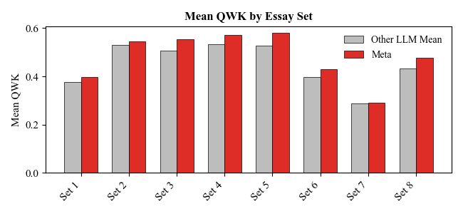
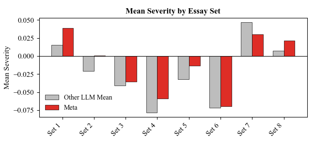
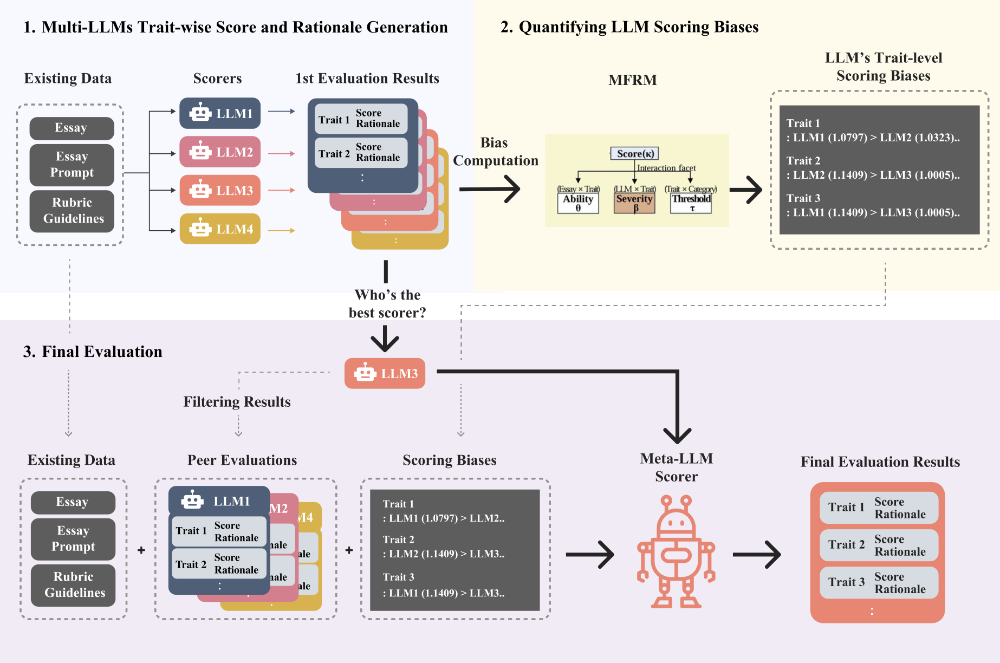
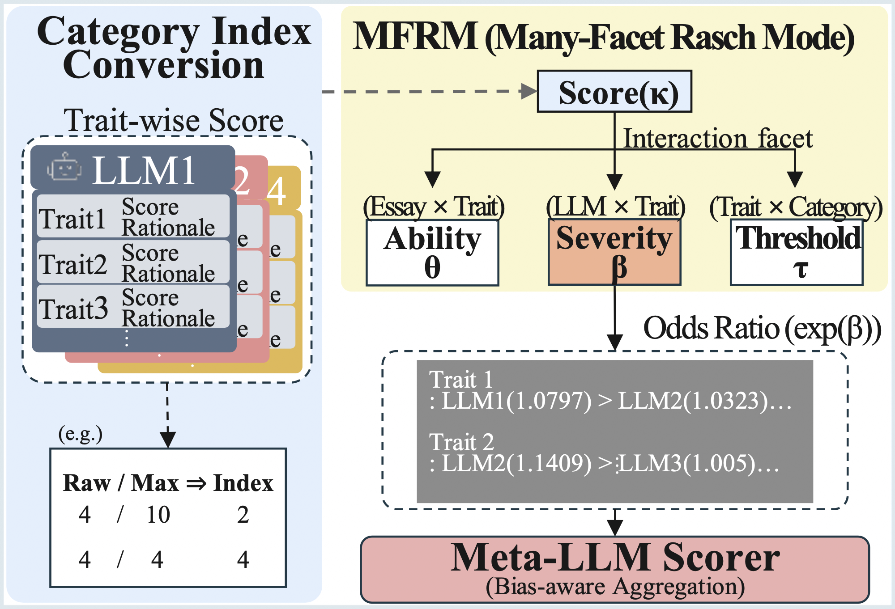

# ADBIAS: Adjusting Multi-LLM Biases via Trait-based Quantitative Analysis for Automated Essay Scoring (AES)

## 👤 Authors

| name | GitHub ID | email |
|------|------------|--------|
|이호진  |leehee16|hojlgg4@gmail.com|
|      |            |        |
|      |            |        |
|      |            |        |
|      |            |        |

<a href="https://github.com/leehee16/ADBIAS/graphs/contributors">
  
</a>

## Project Overview

**ADBIAS** is a research framework designed to improve the fairness and reliability of **Automated Essay Scoring (AES)** by explicitly identifying and correcting biases in multiple large language models (LLMs). Traditional AES systems that rely on a single LLM can produce inconsistent or biased evaluations. ADBIAS tackles this by using **multiple LLMs as “evaluators”** and adjusting their scoring tendencies so that the final essay scores are more accurate and unbiased. In essence, ADBIAS quantitatively measures each model’s bias and incorporates that information into a combined, bias-aware scoring process. This approach leads to more **reliable, fair, and interpretable** essay evaluations than single-model or naive ensemble methods.

<table>
  <tr>
    <td></td>
    <td></td>
  </tr>
</table>

 results on standard AES benchmarks (ASAP and ASAP++) demonstrate ADBIAS’s effectiveness: it **improves scoring accuracy by \~6.4% (Quadratic Weighted Kappa)** and **reduces bias variance by \~57.9%** compared to baseline models. By modeling biases explicitly and aggregating multiple perspectives, ADBIAS provides a **more consistent and transparent** scoring framework for educational assessments.

## Key Features and Architecture
  
*The three-stage bias-aware scoring pipeline in ADBIAS.*

ADBIAS introduces a **three-stage evaluation pipeline** that addresses model bias at each step:

1. **Multi-LLM Evaluation:**  Instead of a single model, ADBIAS uses *multiple LLMs* (e.g., GPT-4, Claude, LLaMA, etc.) to independently score an essay. Each model is given the same essay along with a scoring **rubric**, and each produces **trait-level scores** (e.g., for Content, Organization, Grammar, etc.) as well as a short **rationale** explaining each score. All LLMs use a consistent prompting format and deterministic settings (e.g. temperature = 0) to ensure the scores are directly comparable. This multi-LLM evaluation diversifies the assessment and provides a set of peer “opinions” on the essay’s quality across traits.

  

2. **Bias Quantification via MFRM:** Using the trait-specific scores from all LLMs, ADBIAS applies a **Many-Facet Rasch Model (MFRM)** to quantitatively estimate each model’s **scoring bias or severity**. In practice, this step treats each LLM as a “rater” and each trait score as an observation, and it computes a bias parameter (often called a *severity parameter*) for each model. These bias parameters (converted into convenient metrics like odds ratios) reflect systematic tendencies – for example, one model might consistently give higher Organization scores than others. The calculated bias metrics are then **fed into the next stage** as additional metadata. By calibrating the scores with MFRM, we obtain a bias-adjustment factor for each model-trait, ensuring that no single model’s leniency or harshness unfairly skews the results.

3. **Meta-LLM Aggregation (Final Scoring):** In the final stage,  **Meta-LLM** acts as an aggregator to produce the **final scores** for the essay, taking into account all the information collected. This Meta-LLM (in the paper, one of the models was designated for this role) is provided with: (a) the original essay and prompt, (b) the trait scores and rationales from each of the peer LLMs, and (c) the quantified bias information for each peer. Using this rich input, the Meta-LLM performs a **bias-aware reasoning** to reconcile differences and generate the final trait scores (and an optional overall score or rationale). Instead of naively averaging the scores, the Meta-LLM’s prompt is crafted to encourage it to **adjust for each peer’s bias** and to justify the final decision. This results in a more fair and consistent evaluation, as the Meta-LLM essentially **“corrects” each model’s bias** when forming the final judgment.

**In summary,** the architecture ensures that **model-specific biases are measured and corrected**: multiple opinions are gathered, biases are quantitatively estimated, and a final informed decision is made with bias adjustments. This structured approach increases trust in the automated scores by providing both the **rationales** for decisions and an understanding of how each model’s bias was accounted for.

## Project Structure

```
ADBIAS/
├── LICENSE                  
├── README.md                
├── assets/                  
├── code/                    
│   ├── multi-llms-inference/
│   ├── MFRM.py              
│   └── meta-llm-inference/  
└── data/                    
```

## Installation & Requirements

To get started with ADBIAS, ensure you have the following environment setup:

* **Python 3.x:** The code is written in Python and has been tested with a modern version of Python (e.g., 3.8 or above).
* **PyTorch**: The project uses PyTorch for certain computations (e.g., implementing the Rasch model solver or other data operations). Install PyTorch according to your environment
* **Additional Libraries:** Other Python packages used include typical data science and API tools, for example:

  * `numpy` and `pandas` for data manipulation.
  * `scipy` or `statsmodels` for statistical modeling (if used for Rasch model fitting).
  * LLM API clients or HTTP libraries (e.g., `openai` Python SDK for OpenAI GPT, `anthropic` SDK for Claude, or `requests` for calling model APIs).
  * (Optional) `transformers` from Hugging Face, if you plan to use local models or simulations instead of API calls.

* **LLM API Access:** *Important:* because the models themselves are not packaged with this project, you will need access to the external LLMs used. This typically means having API keys or endpoints for the models (e.g., OpenAI API key for GPT-4, Anthropic API key for Claude, etc.). Make sure to set up your environment with the necessary keys (often via environment variables or a config file) before running the code.


## Future Work and References

ADBIAS is an initial framework and there are several opportunities to extend or improve it:

* **Incorporating More Models or Traits:** The current setup uses a fixed set of LLMs and writing traits. Future versions could easily include additional LLMs (or newer versions) as “peer reviewers,” or evaluate more nuanced traits of writing. The modular design means the pipeline can grow as new models become available or as the scoring rubric expands.
* **Fine-Tuning and Adaptation:** So far, ADBIAS uses pre-trained LLMs via API with prompt engineering. A possible extension is to fine-tune a smaller model (or the Meta-LLM) on collected data for the task, which could allow offline usage and further improvements in consistency. For example, one could train a dedicated Meta-Model on a large set of LLM-scored essays to emulate the bias-adjusted aggregation without needing an API call.
* **Real-Time or Interactive Scoring:** With some engineering, the framework could be turned into a tool for teachers and students – for instance, a web application where a student submits an essay and gets immediate trait scores and feedback rationales. Ensuring the bias adjustment happens quickly (perhaps by caching bias parameters or using a simplified model) would be key for this use-case.
* **Broader Bias Analysis:** While ADBIAS focuses on biases of the models as essay scorers, further research could explore biases related to content (e.g., topic or demographic biases in essays). The framework could be extended to detect if certain types of essays are unfairly scored by all models and flag those cases for human review, improving fairness beyond just model calibration.
* **Generalization to Other Tasks:** The idea of multiple models and bias-aware aggregation could apply to other evaluation tasks (short answer grading, open-ended question scoring, etc.) or even outside of education (e.g., multi-model review aggregation in content moderation). Future work could adapt ADBIAS principles to these areas.

For more details on the ADBIAS methodology and its evaluation, please refer to our research paper: **“ADBIAS: Adjusting Multi-LLM Biases via Trait-based Quantitative Analysis for Automated Essay Scoring (AES)”**. *(A link to arXiv preprint will be provided here upon publication.)*
[ADBIAS Paper](./assets/ADBIAS_Adjusting_Multi_LLM_v1.pdf)


The paper includes comprehensive explanations of the algorithm, technical implementation of MFRM, as well as thorough results on the ASAP datasets supporting the claims of improved accuracy and fairness. We encourage academic and developer readers to consult the paper for deeper insights and to cite ADBIAS in any derivative work.
